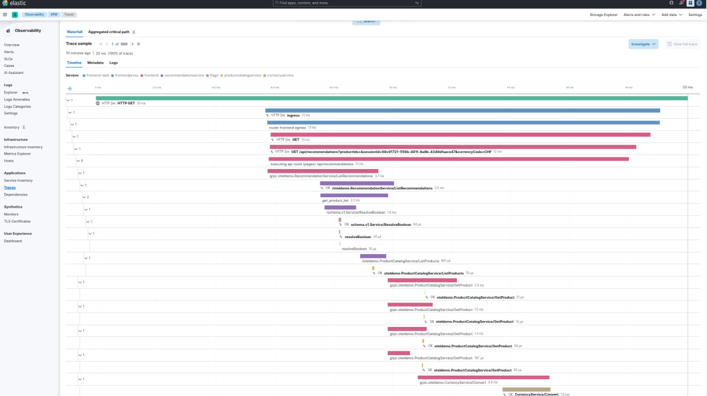

# Sending OpenShift OpenTelemetry Traces to Elastic 
1. [Sending OpenShift OpenTelemetry Traces to Elastic](#sending-openshift-opentelemetry-traces-to-elastic)
   1. [1. Architecture](#1-architecture)
   2. [2. AMQ Streams - Kafka](#2-amq-streams---kafka)
      1. [2.1. Installation](#21-installation)
   3. [3. Elastic ELK stack](#3-elastic-elk-stack)
      1. [3.1. Installation](#31-installation)
   4. [4. OpenTelemetry collectors](#4-opentelemetry-collectors)
   5. [5. OpenTelemetry Demo](#5-opentelemetry-demo)
   6. [6. Supportability](#6-supportability)

## 1. Architecture

This repository is a proof of concept of an architecture that collects traces from applications that use OpenTelemetry library, stores them in Kafka for high availability and long storage and then sends them to the Elastic stack using the APM server. The following diagram showcases the scenario that we have deployed:


## 2. AMQ Streams - Kafka

AMQ Streams simplifies the deployment and management of Apache Kafka clusters in OpenShift by leveraging Kubernetes-native operators. This operator-based approach ensures seamless integration with OpenShift, enabling efficient management of Kafka components such as brokers, topics, and users.


* AMQ Streams documentation: https://docs.redhat.com/en/documentation/red_hat_streams_for_apache_kafka/2.8
* AMQ Streams Console documentation: https://docs.redhat.com/en/documentation/red_hat_streams_for_apache_kafka/2.8/html-single/using_the_streams_for_apache_kafka_console


### 2.1. Installation

The opinionated configuration present in this repo is shared in the format of a Helm Chart. To apply this configuration to the cluster you have two alternatives:

* Either create an ArgoCD application pointing to the Helm Chart:

```bash
cat application-kafka.yaml | \
    CLUSTER_DOMAIN=$(oc get dns.config/cluster -o jsonpath='{.spec.baseDomain}') envsubst | oc apply -f -
```

* Or render the Helm files  manually and sync them to the cluster:

```bash
helm template kafka \
    --set clusterDomain=$(oc get dns.config/cluster -o jsonpath='{.spec.baseDomain}') | oc apply -f -
```


## 3. Elastic ELK stack


In order to store and visualize the traces, we are going to use the Elastic stack deployed on OpenShift using the [Elastic Cloud on Kubernetes](https://www.elastic.co/blog/elastic-cloud-on-kubernetes-red-hat-openshift-certified-operator) (ECK) operator. Using it, we have deployed the following components:

* **Elasticsearch**: It is responsible for indexing, storing, and searching trace data
* **Kibana**: Kibana provides a user-friendly interface for visualizing and analyzing trace data stored in Elasticsearch.
* **APM Server using Fleet**: The APM Server acts as a bridge between OpenTelemetry and Elasticsearch, processing trace data before sending it to Elasticsearch.


Some useful links to read to understand this architecture:

* Fleet vs Standalone https://www.elastic.co/guide/en/fleet/current/elastic-agent-installation.html
* Fleet vs Standalone diagrams: https://www.elastic.co/guide/en/observability/current/apm-getting-started-apm-server.html
* ELK on OCP: https://www.elastic.co/guide/en/cloud-on-k8s/current/k8s-openshift-agent.html

Some useful documents to configure the Elastic Stack on OpenShift:

* Operator: https://www.elastic.co/guide/en/cloud-on-k8s/current/index.html
* Observability: https://www.elastic.co/guide/en/observability/current/index.html
* Fleet: https://www.elastic.co/guide/en/fleet/current/index.html


### 3.1. Installation

To install a basic ELK stack with `Elasticsearch`, `Kibana`, and `APMServer` you have two alternatives:

* Either create an ArgoCD application pointing to the Kustomize folder:

```bash
oc apply -f application-elastic-stack.yaml
```

* Or render the Helm files  manually and sync them to the cluster:

```bash
oc apply -k elastic-stack/
```

Once everything is up and running, to connect to Kibana, use the username `elastic` and retrieve the password using the following command:

```bash
oc get secret elasticsearch-es-elastic-user -o=jsonpath='{.data.elastic}' -n elastic | base64 --decode
```


## 4. OpenTelemetry collectors

Finally, in order to collect the metrics, send them to Kafka, consume them from Kafka and finally store them on Elastic, we need to deploy two OpenTelemetry instances. 

> [!TIP]
> The basic configuration of OpenTelemetry, as well as the installation of the operator is already provided in this other [repository](https://github.com/alvarolop/quarkus-observability-app?tab=readme-ov-file#42-red-hat-build-of-opentelemetry). Please, check it out and deploy it. 

First, create a secret in the OpenTelemetry namespace with the Secret Token that it has to use to send Traces to the Elastic deployment:

```bash
oc create secret generic elastic-token -n otel --from-literal=secret-token=$(oc get secret apm-server-apm-token -n elastic --template='{{index .data "secret-token" | base64decode}}')
```

Then, just deploy the two instances:

```bash
oc apply -k otel-collector
```


## 5. OpenTelemetry Demo

The OpenTelemetry Astronomy Shop is a microservice-based distributed system intended to illustrate the implementation of OpenTelemetry in a near real-world environment. This is one of the demos used to showcase this deployment. 


In the following figure, you can see an example of a trace created by the demo application:




The following links provide extra information to understand all the components of the demo:

* https://opentelemetry.io/docs/demo/architecture/
* https://github.com/open-telemetry/opentelemetry-demo
* https://github.com/open-telemetry/opentelemetry-helm-charts/tree/main/charts/opentelemetry-demo


## 6. Supportability

In my opinion, the presented PoC combines simplicity and top-tech components to collect, store and visualize Traces in OpenShift. However, as of today - January 2025 - there are still some components that are not GA yet:

* OpenTelemetry Kafka [receiver](https://docs.openshift.com/container-platform/4.17/observability/otel/otel-collector/otel-collector-receivers.html#kafka-receiver_otel-collector-receivers) and [exporter](https://docs.openshift.com/container-platform/4.17/observability/otel/otel-collector/otel-collector-exporters.html#kafka-exporter_otel-collector-exporters) is Tech Preview.
* OpenTelemetry [Kubernetes Attributes Processor](https://docs.openshift.com/container-platform/4.17/observability/otel/otel-collector/otel-collector-processors.html#resource-processor_otel-collector-processors) is Tech Preview.


